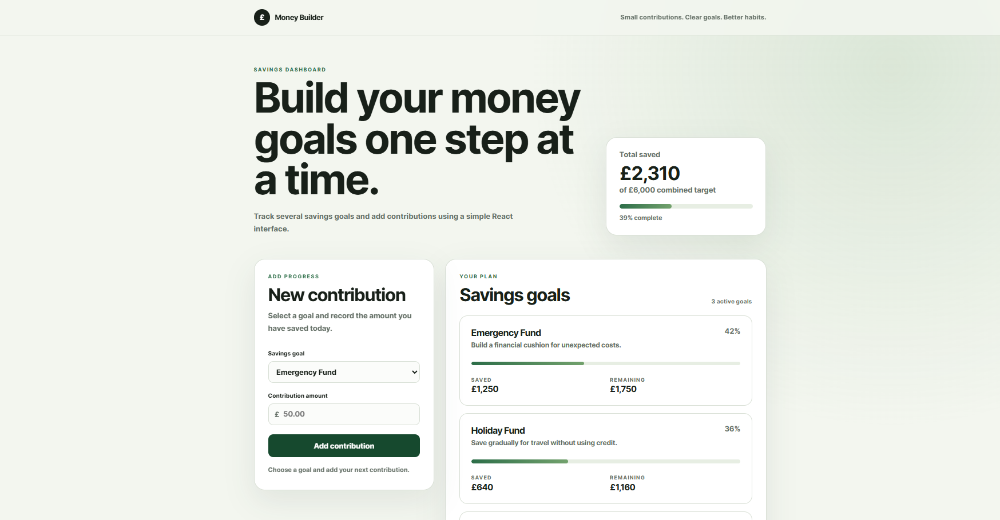

# React Money Builder

Money Builder is a responsive savings-goal application built with React 18 and Vite. It allows users to view several financial goals, track overall progress and add new contributions through an interactive form.

## Live Project

Add the deployed Vercel or Netlify URL here after deployment.

## GitHub Repository

[View the GitHub repository](https://github.com/huzaifah08/react-money-builder)

## Screenshot

Add a screenshot to `screenshots/money-builder-home.png`, then use:

```markdown

```

## Features

- Responsive savings dashboard
- Multiple reusable React components
- Interactive contribution form
- Goal selection and amount validation
- Live progress updates using React state
- Reusable goal cards rendered from array data
- Overall and individual progress bars
- Responsive layout for desktop, tablet and mobile

## React Concepts Used

### Functional components

The application is split into focused functional components:

- `App`
- `Header`
- `SummaryCard`
- `ContributionForm`
- `GoalCard`
- `MoneyTip`

Each component is responsible for a specific part of the interface. This makes the project easier to read, test and maintain.

### JSX

JSX is used to describe the interface inside JavaScript. It allows HTML-like elements, JavaScript expressions and component instances to be written together.

```jsx
<GoalCard key={goal.id} goal={goal} />
```

### Props

Props pass information from a parent component to a child component. For example, `App` passes each goal object into `GoalCard`:

```jsx
<GoalCard goal={goal} />
```

The child component receives and displays that data:

```jsx
function GoalCard({ goal }) {
  return <h3>{goal.title}</h3>;
}
```

### State management

The `useState` Hook stores values that can change while the user interacts with the application.

```jsx
const [goals, setGoals] = useState(initialGoals);
```

When a contribution is added, `setGoals()` creates an updated goals array. React detects the state change and renders the affected components again.

### Event handling

The contribution form uses an `onSubmit` event. The form validates the amount and passes the contribution to the parent component through a callback prop.

### Rendering lists

The application uses `map()` to turn arrays into reusable React components:

```jsx
goals.map((goal) => (
  <GoalCard key={goal.id} goal={goal} />
));
```

Each component receives a unique `key` so React can track list items efficiently.

### Derived values

The overall saved amount and target are calculated from the goals state using `reduce()`:

```jsx
const totalSaved = goals.reduce(
  (total, goal) => total + goal.saved,
  0,
);
```

These values do not need separate state because they can be calculated from the existing goals array.

## How React Renders the App

The `index.html` file contains an empty root element:

```html
<div id="root"></div>
```

The entry file `src/main.jsx` creates a React root and renders the `App` component inside that element:

```jsx
ReactDOM.createRoot(document.getElementById("root")).render(
  <React.StrictMode>
    <App />
  </React.StrictMode>,
);
```

React then manages updates to the page through its component and rendering system whenever state changes.

## Vite

Vite provides the local development server and production build process for this project.

The main npm scripts are:

```json
{
  "dev": "vite",
  "build": "vite build",
  "preview": "vite preview"
}
```

## Project Structure

```text
react-money-builder/
├── index.html
├── package.json
├── package-lock.json
├── vite.config.js
├── .gitignore
├── README.md
└── src/
    ├── App.jsx
    ├── index.css
    ├── main.jsx
    └── components/
        ├── ContributionForm.jsx
        ├── GoalCard.jsx
        ├── Header.jsx
        ├── MoneyTip.jsx
        └── SummaryCard.jsx
```

## Run the Project Locally

### Requirements

- Node.js
- npm

### Installation

1. Clone the repository:

```bash
git clone https://github.com/huzaifah08/react-money-builder.git
```

2. Enter the project folder:

```bash
cd react-money-builder
```

3. Install the dependencies:

```bash
npm install
```

4. Start the Vite development server:

```bash
npm run dev
```

5. Open the local URL displayed in the terminal, usually `http://localhost:5173`.

## Production Build

Create an optimized production build with:

```bash
npm run build
```

Vite places the production files in the `dist/` folder.

Test the production build locally with:

```bash
npm run preview
```

## What I Learned

This project helped me understand:

- How React differs from a full framework
- How to create functional React components
- How to write interfaces with JSX
- How to pass data and callbacks through props
- How to store and update values with `useState`
- How React re-renders components after state changes
- How to handle forms and browser events
- How to render reusable components from arrays
- How Vite runs and builds a React project
- How `index.html`, `main.jsx` and the React root connect
- How to use Git and GitHub to track project development
